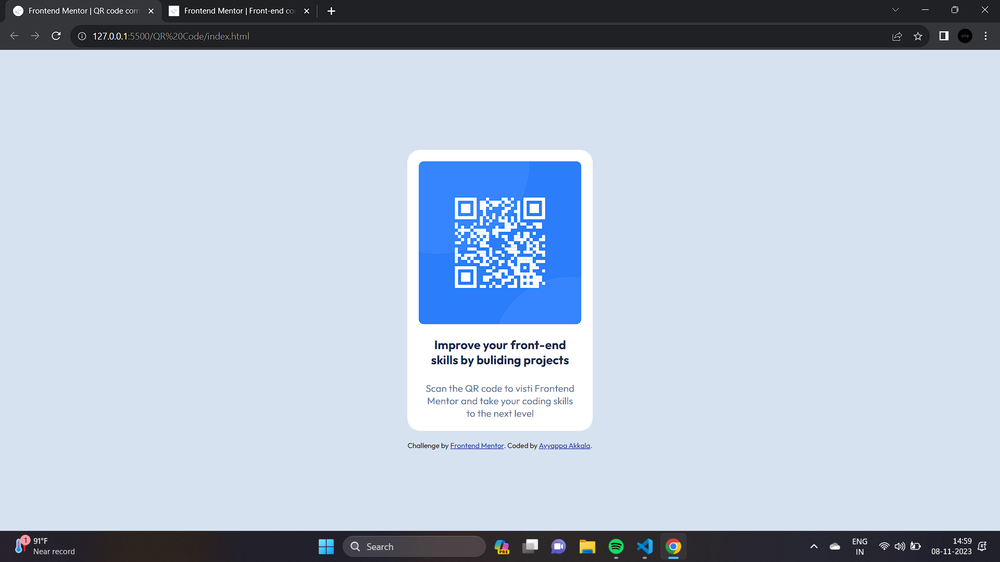
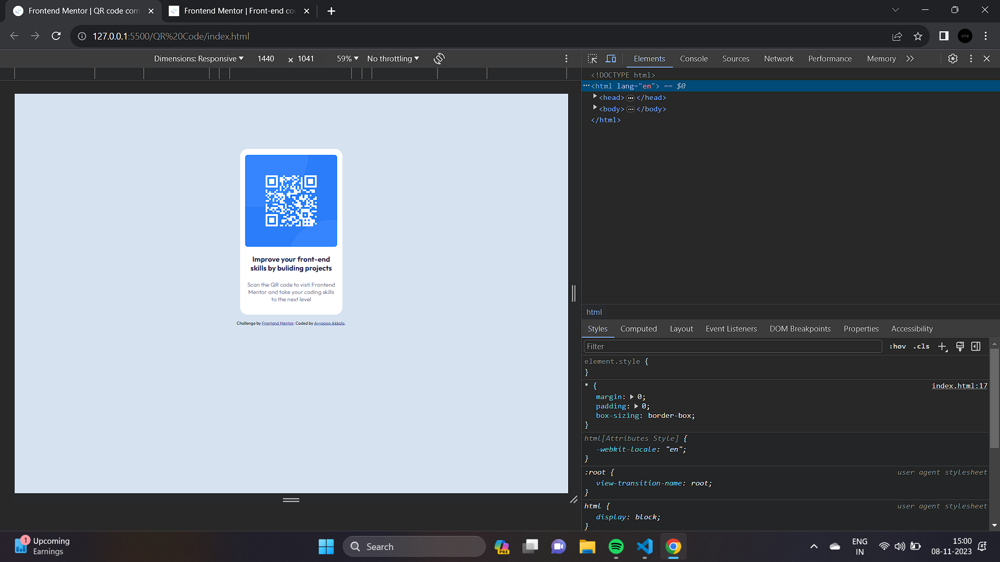
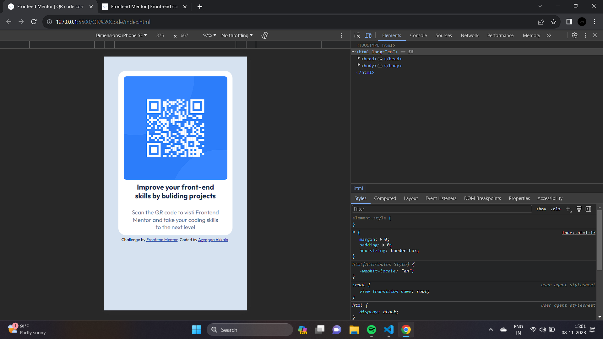

# Frontend Mentor - QR code component solution

This is a solution to the [QR code component challenge on Frontend Mentor](https://www.frontendmentor.io/challenges/qr-code-component-iux_sIO_H). Frontend Mentor challenges help you improve your coding skills by building realistic projects.

## Table of contents

- [Overview](#overview)
  - [Screenshot](#screenshot)
  - [Links](#links)
- [My process](#my-process)
  - [Built with](#built-with)
  - [What I learned](#what-i-learned)
  - [Continued development](#continued-development)
  - [Useful resources](#useful-resources)
- [Author](#author)
- [Acknowledgments](#acknowledgments)

## Overview

This is a solution to the QR code component challenge on Frontend Mentor. Frontend Mentor challenges help you improve your coding skills by building realistic projects.

### Screenshot

### Links

- Solution URL: [Add solution URL here](https://your-solution-url.com)
- Live Site URL: [Add live site URL here](https://your-live-site-url.com)

## My process

I approached the QR code component challenge by breaking it down into several key steps:

1. **HTML Structure**: I started by creating the HTML structure for the project, including the necessary elements, such as the container, image, heading, and paragraphs.

2. **Styling with CSS**: I applied CSS styles to achieve the desired layout and design. This included setting up the container's dimensions, fonts, and alignment.

3. **Responsive Design**: I made sure the project was responsive by adjusting the styles and layout for different screen sizes. I used media queries to handle responsiveness.

4. **Optimizing Images**: I optimized the QR code image to improve loading times and overall performance.

5. **Final Touches**: I added any final touches, such as making sure the project looked great on various devices and adjusting any additional styling details.

The project was built using semantic HTML5 markup, CSS custom properties, and flexbox for layout. This process allowed me to complete the QR code component challenge successfully.

### Built with

- **Semantic HTML5 markup**: Used to structure the content of the project.

- **CSS custom properties**: Employed to define and manage styling elements.

- **Flexbox**: Utilized for layout and positioning of elements within the project.

- **Optimized Images**: Included optimized images for faster loading times.

- **Google Fonts**: Imported the 'Outfit' and 'Roboto' fonts for text elements.

### What I learned

While working on the QR code component project, I gained valuable insights and skills in the following areas:

- **Creating Responsive Designs**: I improved my ability to create responsive web designs that adapt to different screen sizes. Using media queries and CSS techniques, I ensured the project looked great on a variety of devices.

- **Optimizing Images**: I learned how to optimize images for web use, improving page loading times and user experience.

- **Using Google Fonts**: I incorporated custom fonts into the project by using Google Fonts, enhancing the typography and overall visual appeal.

- **HTML and CSS Best Practices**: I reinforced my knowledge of HTML5 and CSS best practices, including semantic markup, naming conventions, and clean, maintainable code.

- **Design Consistency**: I focused on maintaining a consistent design style and layout throughout the project, which is crucial for a professional and polished appearance.

These learnings have not only helped me complete the QR code component challenge but have also enhanced my front-end development skills.

### Continued development

While completing the QR code component challenge, I identified several areas I'd like to continue focusing on in my future projects:

- **JavaScript Integration**: In future projects, I plan to incorporate JavaScript to add interactivity and dynamic functionality to my web applications. This will enhance the user experience and open up more possibilities for feature development.

- **Accessibility**: I aim to improve my understanding of web accessibility principles and practices to ensure that my projects are usable by a wider audience.

- **CSS Frameworks**: Exploring popular CSS frameworks like Bootstrap or Tailwind CSS to streamline the styling and layout of my projects.

- **Version Control**: I want to further familiarize myself with version control systems like Git and GitHub to manage project collaboration and track changes effectively.

- **Responsive Web Design**: Continuing to refine my skills in responsive web design to create seamless user experiences on all types of devices.

- **User Experience (UX) Design**: Learning more about UX design principles and techniques to create more user-friendly and engaging interfaces.

By focusing on these areas, I hope to grow as a developer and take my projects to the next level in terms of functionality, design, and user satisfaction.

## Useful Resources

During the QR code component project, I found the following resources helpful:

- [Frontend Mentor](https://www.frontendmentor.io?ref=challenge): The Frontend Mentor platform, which hosted this challenge, was an excellent resource for honing my front-end development skills and finding real-world projects to work on.

- [Google Fonts](https://fonts.google.com/): I used Google Fonts to access a wide variety of fonts and improve the typography of the project.

These resources played a significant role in guiding me through the project and enhancing my development skills. I recommend checking them out if you're looking to expand your knowledge and capabilities as a front-end developer.

## Author

- Website - [Ayyappa Akkala](https://www.your-site.com)
- Frontend Mentor - [@Ayyappanakkala](https://www.frontendmentor.io/profile/@Ayyappanakkala)

## Acknowledgments

I'd like to extend my gratitude to the following individuals and organizations who contributed to the success of this project:

- **Frontend Mentor**: I'm thankful to Frontend Mentor for providing a platform with real-world challenges that allowed me to apply and improve my front-end development skills.

Acknowledging the contributions and support you received is a way to show appreciation and build positive relationships within the development community.
